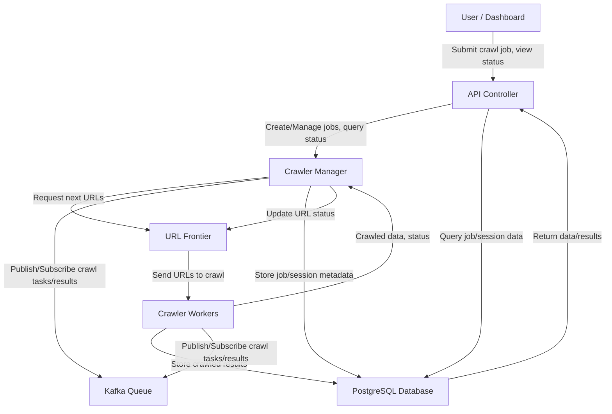

# Distributed Web Crawler Architecture

**Detailed Dataflow Explanation:**
- **User → Controller:** Users submit crawl jobs and view crawl status via the dashboard or API.
- **Controller → Manager:** The API Controller creates or manages crawl jobs and queries their status from the Crawler Manager.
- **Manager → Frontier:** The Crawler Manager requests the next set of URLs to crawl from the URL Frontier.
- **Frontier → Worker:** The URL Frontier assigns URLs to available Crawler Workers for processing.
- **Worker → Manager:** After crawling, Workers send crawled data and status updates back to the Manager.
- **Worker → DB:** Workers store the actual crawled page content and metadata in the PostgreSQL database.
- **Manager ↔ Kafka ↔ Worker:** Both Manager and Workers use Kafka to publish and subscribe to crawl tasks and results, enabling distributed coordination and scalability.
- **Manager → DB:** The Manager stores job/session metadata and crawl statistics in the database.
- **Controller → DB:** The Controller queries the database for job/session data to present to users.
- **DB → Controller:** The database returns requested data/results to the Controller for user display.
- **Manager → Frontier:** The Manager updates the status of URLs in the Frontier (e.g., marking as crawled, failed, or pending).

This diagram illustrates the main components and their interactions in the distributed web crawler system:
- **User/Dashboard**: Interacts with the system via the API Controller.
- **API Controller**: Handles user requests and communicates with the Crawler Manager.
- **Crawler Manager**: Orchestrates crawling, manages sessions, and coordinates with the URL Frontier and Kafka.
- **URL Frontier**: Manages the queue of URLs to be crawled.
- **Crawler Workers**: Distributed workers that fetch web pages and send results back.
- **Kafka Queue**: Used for distributing crawl jobs and results between components.
- **PostgreSQL Database**: Stores crawled data, sessions, and statistics.

## Overview

This document outlines the architecture for a distributed web crawler system with built-in scalability, resilience, and a user interface. The system is designed to efficiently crawl websites at scale while being fault-tolerant and easy to monitor.

## System Components

### 1. Core Components

#### 1.1. Crawler Manager
- **Purpose**: Central coordination unit for the distributed crawler system
- **Responsibilities**:
  - Distributes crawling tasks to worker nodes
  - Monitors system health and performance
  - Implements rate limiting and politeness protocols
  - Manages the URL frontier and visited URL registry
  - Handles system configuration

#### 1.2. Worker Nodes
- **Purpose**: Execute the actual crawling tasks
- **Responsibilities**:
  - Fetch web pages according to assigned tasks
  - Parse HTML content
  - Extract links, metadata, and content
  - Report results back to the Crawler Manager
  - Handle retries for transient failures

#### 1.3. URL Frontier
- **Purpose**: Prioritized queue of URLs to be crawled
- **Implementation**: Distributed priority queue with Redis/Kafka
- **Features**:
  - Prioritization based on configurable metrics
  - Domain-based sharding to respect politeness requirements
  - Deduplication of URLs

#### 1.4. Content Processor
- **Purpose**: Process and store crawled content
- **Responsibilities**:
  - Content extraction and normalization
  - Text indexing
  - Media handling
  - Metadata extraction
  - Content classification

### 2. Storage Layer

#### 2.1. Metadata Store
- **Purpose**: Store metadata about crawled pages
- **Implementation**: MongoDB/Cassandra
- **Stored Data**:
  - URL information
  - Crawl timestamps
  - HTTP headers
  - Content metadata
  - Crawl status information

#### 2.2. Content Store
- **Purpose**: Store actual page content
- **Implementation**: HDFS/S3/Object Storage
- **Features**:
  - Versioning of content over time
  - Compression
  - Content-addressable storage

#### 2.3. URL Registry
- **Purpose**: Track visited URLs to prevent duplicate crawling
- **Implementation**: Distributed Bloom filter/Redis
- **Features**:
  - Fast lookup
  - Memory-efficient storage
  - Time-based expiration

### 3. Communication Layer

#### 3.1. Message Queue
- **Purpose**: Asynchronous communication between components
- **Implementation**: Kafka/RabbitMQ
- **Message Types**:
  - Crawl tasks
  - Crawl results
  - System events
  - Health checks

#### 3.2. Service Discovery
- **Purpose**: Dynamic discovery of system components
- **Implementation**: ZooKeeper/Consul
- **Features**:
  - Health checking
  - Dynamic configuration
  - Load balancing

### 4. User Interface

#### 4.1. Web Dashboard
- **Purpose**: Monitoring and control of the crawler system
- **Features**:
  - Real-time system metrics
  - Crawl job management
  - Configuration management
  - Data visualization
  - Alert notifications

#### 4.2. Admin API
- **Purpose**: Programmatic control of the crawler
- **Implementation**: RESTful API
- **Endpoints**:
  - Job management
  - System configuration
  - Statistics and reporting
  - Authentication and authorization

#### 4.3. Search Interface
- **Purpose**: Search and explore crawled content
- **Features**:
  - Full-text search
  - Faceted navigation
  - Result filtering
  - Export capabilities

## Resilience Features

### 1. Fault Tolerance
- Stateless worker design for easy recovery
- Automatic task reassignment on worker failure
- Persistent queues to prevent task loss
- Circuit breakers to handle external service failures

### 2. Rate Limiting
- Per-domain rate limiting
- Configurable crawl delays
- Respect for robots.txt directives
- Adaptive rate limiting based on server response

### 3. Error Handling
- Retry mechanisms with exponential backoff
- Error categorization (transient vs. permanent)
- Crawl attempt limiting
- Dead URL detection and removal

## Scalability Features

### 1. Horizontal Scaling
- Dynamic worker provisioning based on load
- Sharding of URL frontier by domain
- Distributed content processing
- Stateless component design

### 2. Performance Optimizations
- Connection pooling
- DNS caching
- Content compression
- Asynchronous I/O
- Batch processing where applicable

### 3. Resource Management
- Worker resource limits
- Prioritized task scheduling
- Configurable crawl depth and breadth
- Adaptive resource allocation

## Monitoring and Maintenance

### 1. Monitoring
- Real-time system metrics
- Component health checks
- Performance dashboards
- Alert notifications

### 2. Logging
- Centralized log collection
- Log levels for debugging
- Audit trails for operations
- Error aggregation

### 3. Administration
- Configuration management
- System backup and recovery
- Version management
- Rolling updates

## Technology Stack

### Backend
- **Language**: Java
- **Frameworks**: Spring Boot, Akka
- **Storage**: MongoDB/Cassandra, HDFS/S3
- **Messaging**: Kafka/RabbitMQ
- **Coordination**: ZooKeeper/Consul

### Frontend
- **Framework**: React/Angular
- **Data Visualization**: D3.js/Chart.js
- **State Management**: Redux/MobX
- **UI Components**: Material-UI/Ant Design

### DevOps
- **Containerization**: Docker
- **Orchestration**: Kubernetes
- **CI/CD**: Jenkins/GitHub Actions
- **Monitoring**: Prometheus/Grafana

## Implementation Phases

### Phase 1: Core Crawler
- Basic crawler manager
- Worker implementation
- Simple URL frontier
- Local storage

### Phase 2: Distribution & Scaling
- Message queue integration
- Distributed URL frontier
- Worker auto-scaling
- Persistent storage implementation

### Phase 3: Resilience & Performance
- Error handling improvements
- Rate limiting
- Performance optimizations
- Monitoring system

### Phase 4: User Interface
- Admin dashboard
- Configuration management
- System monitoring
- Search interface

### Phase 5: Advanced Features
- Content analysis
- Machine learning integration
- API enhancements
- Third-party integrations

## Conclusion

This distributed web crawler architecture is designed to be scalable, resilient, and maintainable. By separating concerns into distinct components and implementing proper communication channels, the system can grow to handle large crawl volumes while maintaining performance and reliability. The UI components provide easy monitoring and control of the system, making it suitable for both automated and human-supervised crawling operations.
